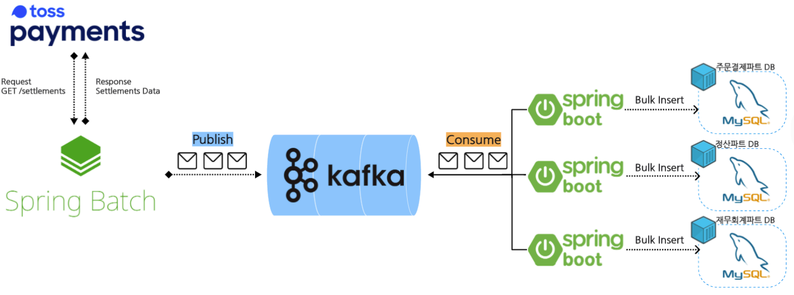
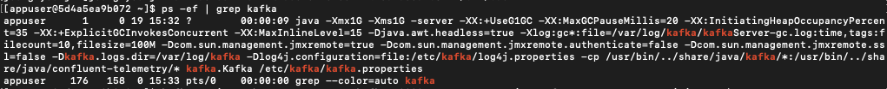
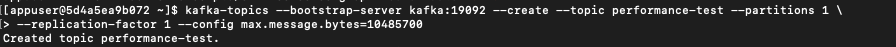
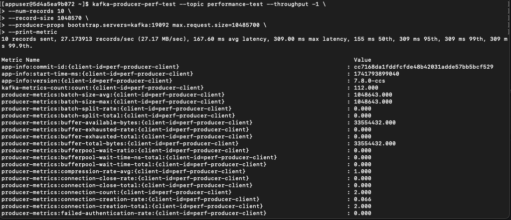
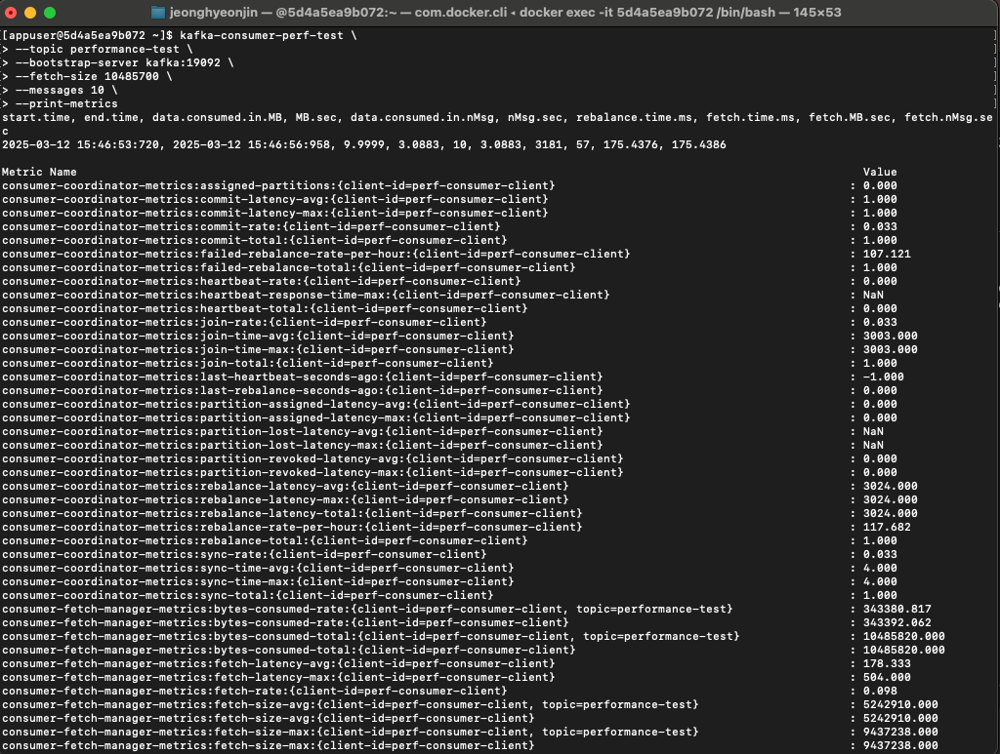
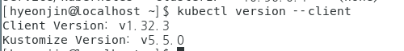
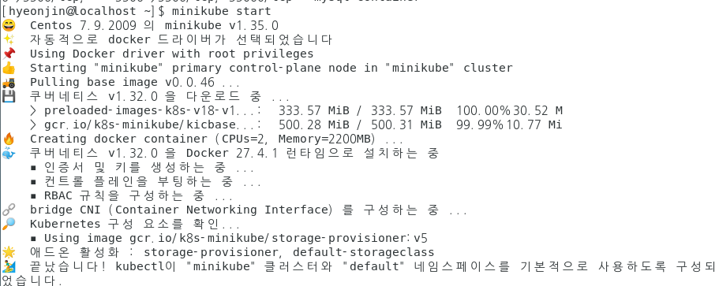
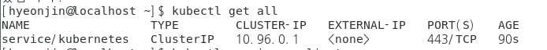
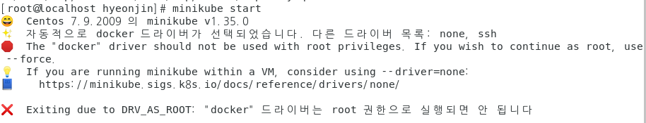
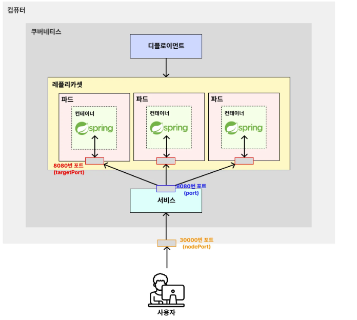

## ecommerce-purchaseOrder-payment-system

### 요구사항 분석

#### 1. 상품 주문
- 상품 주문은 최소 1개 이상 주문해야 한다.
- 한번의 주문에 다수의 상품을 n개 구매할 수 있다.
- 한번의 주문에 동일의 상품을 n개 구매할 수 있다.
- 결제 수단을 카드 결제만 가능하며, 추후 결제 수단은 추가될 수 없다.

#### 2. 상품 결제
- "주문 완료"된 건에 대해서만 결제를 진행할 수 있다.

#### 3. 주문 취소
- "구매 확정"된 상품은 주문 취소할 수 없다.
- 결제 취소 진행은 상품이 재입고된 이후에 진행된다.
- 결제 취소는 부분 취소 및 전체 취소가 가능하다.

#### 4. 주문 || 결제 정산
- 결제일 + 영업일 기준 3day 건에 대해서 정산이 이루어진다.
- Tosspayments에서 제공하는 정산 API를 호출해서 정산 완료된 주문 건에 대해서 데이터를 적재한다.
- 방법 1. 개발 환경에서 Mockito로 비즈니스 로직만 테스트하고 운영 환경에 배포 후, 테스트를 한다.
- 방법 2. Mock Server를 이용해서 API까지 테스트를 한다.

### 이벤트 스토밍

#### 1. 도메인 이벤트 (Domain event) 도출
#### 2. 이벤트에 따른 정책(Policy) 도출
#### 3. Command와 Actor 도출
#### 4. Aggregate 매핑

### 프로젝트 구조
#### 1. Presentation
        사용자의 요청을 처리하고 사용자에게 정보를 보여주는 역할을 한다.
        controller역할을 한다고 생각할 수도 있지만 presentation은 controller처럼 http에만 종속된는 것이 아니라
        외부 시스템일 수도 있다. 여기서 외부 시스템은 Front Server가 될수도 있고 OpenApi 형태로 다른 특정한 백엔드 시스템이 우리한테 Request를 요청하는
        시스템이 될 수도 있다.
#### 2. Application
        사용자가 요청한 기능을 실행한다. 업무 로직을 직접 구현하지 않으며 도메인 계층을 조합해서 기능을 실행한다.
        Service단이라고 생각하면 되는데 핵심 Service 로직은 도메인에서 다 구현하고
        그냥 도메인에 있는 로직을 조합하는 곳이라고 생각하면 쉬울 것 같다.
        정리하자면 기능 구현을 책임지고 있는 것이 아니라, 만들어져 있는 기능을 조합해서 온전한 기능을 구현하는 계층이다.
#### 3. Domain
        시스템(비즈니스)이 제공해야 하는 도메인 규칙을 구현한다.
        비즈니스의 핵심 규칙을 정의하고 구현하는 곳이다.
#### 4. Infrastructure
        application의 context 경계를 벗어나는 외부 시스템과의 연동을 구현한다.
        인프라인스트럭처 및 도메인 계층을 제외한 나머지 계층에서는 저수준 모듈이 아닌 고수준 모듈에 의존해서
        코드를 작성하고 도메인과 인프라인스트럭처 계층에서는 저수준 모듈을 구현하여 실제 기능을 제공한다는 것이
        다른 계층과의 차이점을 가진다.

** DDD 는 중복을 감수하고 가는 것이다 ??

### 토스 결제 API 정리
https://docs.google.com/spreadsheets/d/1ts5o2Wm6C4avU44-AHIwWIV1PhUVz4-10soBuVSq3ms/edit?usp=sharing

### DIP
 고수준과 저수준 모듈 (DIP)
 우리 프로젝트에서는 구현체(저수준 모듈)에 직접 의존하지 않는다.
 추상체 or 인터페이스에 의존하여 기능을 완성시킨다.
 
### TDD

#### 메소드명 컨벤션
 [테스트 진행할 메소드 명] _ [결과값] _ [테스트 케이스에 대한 시나리오]
 이런 식으로 작성하면 된다.
 ex ) 하나의 주문에 동일한 상품을 n개 구매할 수 없다.
 verifyDuplicatedOrderItemId_True_NotDuplicateProductId()
 
#### JPA TEST
 @DataJpaTest : JPA 관련 전용 테스트로 테스트 진행 시 관련 Bean만 띄운다.
 @AutoConfigureTestDataBase : 개발 DB , 운영 DB 를 사용하지 않고 TEST용 DB(H2)를 사용해서
  테스트를 진행할 수 있게 설정 해주는 어노테이션
 
#### 순서
 1. 일단 제일 먼저 도메인과 response, request dto, 공통 코드, 인프라 관련 틀을 먼저 코드를 작성해주고
 2. 요구사항에 따라서 TDD 를 작성해주면서 해당 관련 비지니스 로직들을 작성해주는게 편한 것 같다 (controller, port, service, repository 등등)

#### TransactionType에 관하여
- transactionType 결제 타입은 지금 당장은 카드 결제만 고려를 했지만 앞으로 카드, 계좌이체, 가상계좌 등등
다양한 결제 타입의 확장성을 고려한 개발을 해야한다. 따라서 domain에 TransactionType 이라는 부모클래스를 만들고
cardPayment,AccountPayment 등등 여러개의 도메인을 만들어준 다음 transactionType을 상속받는다면 repository를 구현할 때에도
결제 방식 별로 로직을 객체지향적으로 구분할 수 있다는 장점을 가진다.

### 정산 - 대용량 데이터 처리의 필요성
 #### 가정 1) 지금은 정산 데이터가 테스트 용도로 4개 밖에 없지만, Fast-Ecommerce가 실제 서비스를 시작하고 홍보가 잘되고 제품이 좋아서 거래 건이 폭발적으로 늘어났다.
 #### 가정 2) 그래서 1일 기준 정산 데이터가 총 1억건이고, 1번에 5,000건 씩 20,000번 API 요청을 보내고 데이터를 DB에 쓰는 작업을 처리 해야 한다.

 예상 되는 문제 1) Batch Bulk Insert 시, **다양한 요인**(DB의 Table Lock으로 Timeout Exception, 네트워크 문제, 서버 리소스 문제 등)
                 으로 발생할 수 있는 데이터 유실

 예상 되는 문제 2) 점점 더 많아지는 정산 데이터로 인해 정산 프로세스 처리 및 데이터 적재까지 소요되는 시간이 점차 증가

 예상 되는 문제 3) 동일한 데이터를 타 부서에서도 **동일한 API**(네트워크 리소스 낭비, API의 Late Limit 초과로 비용 발생 등)를 호출해서 데이터를 적재 후, 연결

HOW ?

Kafka(Message Queue)를 이용하면 빠르고 안정적으로 정산 데이터를 처리 및 적재가 가능하며 API를 통해서 가져온 원천 데이터를 공유 및 재사용이 가능하다.

1. 최초 API의 요청 결과로 응답 받은 Response Message를 Publisher 가 MQ에 Message를 발생(publish) 한다.
2. Consumer가 발행된 최초 메시지를 읽어서 처리하고 있는 동안, Publisher는 2번째 API의 요청 결과로 응답 받은 Response Message를 발행한다.
3. Response Message가 비어(Empty) 있을 때까지 이 과정을 계속해서 반복한다.
4. 발행하고 구독한 메시지를 타 부서의 Application에서도 구독이 가능하다.

Spring Batch가 Kafka Producer 역할을 한다.
- API 응답 메시지를 Kafka의 Broker에게 메시지를 발행하는 역할을 한다.
- 다른 프레임워크를 사용해서 구현 가능하다

Spring Boot가 Kafka Consumer 역할을 한다.
- Kafka의 Broker에게 발행된 메시지를 구독하고 처리하는 역할을 한다.
- 다른 프레임워크를 사용해서 구현 가능하다

### KafKa

실무에서 카프카를 쓰는 이유 : 이커머스에서는 정산 데이터가 있으면 이 정산 데이터를 여러 부서에서 쓴다 그럼 여러 부서에서 api 콜이나 디비 조회를 하게 되는데 이렇게 여러번
호출하게 되면 부하가 많이 일어나고 디비 lock이 일어날 수 있다.
그래서 카프카를 이용하면 어떤 한 부서에서 정산데이터를 프로듀싱하면 여러 부서에서 컨슈밍만 해주면 정산데이터를 쓸 수 있기 때문에 유용함

대량의 데이터를 안정적이고 실시간으로 처리할 수 있도록 설계된 **메시징 플랫폼**을 말한다.
기업에서 **대규모 데이터 처리 및 이벤트 기반 시스템**을 구축하는데 널리 사용되며 인체에 중추 신경계에 해당하는 역할을 수행한다.

- 안정적 : partition 2번이 죽었다고 해서 데이터가 날아가는 것이 아니라 안정적으로 보존되는 것

- 실시간 : producer에서 데이터를 publishing 하면 consumer가 실시간으로 데이터를 받는 것

- 이벤트 기반 시스템 : 어떠한 데이터를 직접적으로 처리하는 것이 아니라 이벤트만 발행해서 해당 이벤트를 적절하게 컨슈머가 처리하는 것

#### Producer

Kafka의 Broker에게 메시지(message == record == event == data)를 발행하는 역할을 수행하는 주체를 **Producer**라고 한다.
메시지(Record)의 구조는 Key-value 형태를 가지며 Key의 Hash 값을 기준으로 Topic의 Partition을 선택한다.

메시지 전달 과정
1. Records 직렬화

   메시지를 직렬화해서 Key와 Value를 바이트로 변홚나다. 대표적인 직렬화 포맷은 JSON과 Avro가 있다.
2. 파티셔닝(Patitioner)
3. 압축
4. 메시지 배치
5. 전달

#### Topic

topic은 N개의 partition을 가질 수 있다. 파티션을 지정할 때에는 라운드 로빈 방식으로 차례대로 지정할 수도 있고 key의 hash값을 기준으로 partition을 지정할 수도 있다.

#### Confluence Schema Registry; 메시지 형식

비지니스 요구사항의 변경으로 발행되는 메시지의 형태만 먼저 변경이 되었고 아직 consumers는 변경된 메시지의 형태를 알지 못하는 상황에 빠지게 된다면
consumers는 메시지 처리를 정상적으로 하지 못하고 오류가 발생한다.
예를 들면 name이라는 컬럼을 가지는 메시지가 있었는데 이 컬럼을 삭제를 해야한다. 이걸 producers에서는 적용을 했는데 consumers에서는 그 삭제된 내용이 반영이 되지 않았다면
역질렬화 할 때 오류가 발생하게 되는데 이러한 메시지의 스키마를 관리하고 안전한 방향으로 **진화**하고 있는지 확인하는 것이 중요해졌고
필요성이 제기되어서 스키마 레지스터리가 생겼다.

직렬화할 때 스키마 레지스트리에서 확인 검증을 한다. 형식에 맞지 않으면 애초에 차단 메시지를 발행시키지 않음 -> 애초에 잘못된 메시지로 전달하지 않는다는 장점이 있다.

Q. avro와 다른 어떤 종류가 있는지 왜 avro를 선택 ??

### 도커 이미지로 로컬 서버에 배포하기
Dockerfile은 Docker container image를 생성하기 위한 script(설정 파일)을 말한다.
도커 파일을 먼저 빌드해서 이미지를 만들고 그 이미지를 compose 파일에 작성해서 한꺼번에 실행하는 것을 선호

### 성능 테스트 ; Performance
### 정의
 시스템 구성 요소가 특정 상황에서 어떤 성능을 보이는지 확인하기 위해 수행되는 테스트를 말한다.
### 목적
 Kafka Broker가 1노드 구성일 때, Throughput(초당 record 처리 수)이 얼마나 나오고 우리가 개발한 어플리케이션에서
 초당 발행하는 레코드를 Latency 없이 처리할 수 있는지를 확인하는 것이 목적이다.
 만약 Latency가 발생한다면 우리는 서비스 장애 또는 오류가 발생하기 전 Kafka를 Scale Up || Out를
 해야 한다라는 판단을 내릴 수 있는 기회를 획득 한 것

프로듀서 성능테스트 메트릭

컨슈머 성능테스트 메트릭

이러한 결과값들을 가지고 성능을 더 올려달라고 요청할 수 있다.
근데 저런 성능테스트를 가지고 어떻게 부하가 생기는지 알 수 있지 ??

### ec2 생성 후 배포
ec2 서버 생성 후 인텔리제이로 ssh, 및 sftp 연결
sftp : tools - deployment - Configurations -> 서버 설정, ssh 설정
ssh : 터미널 클릭해서 화살표 누르면 서버 접속 가능

#### 도커 패키지 설치
1. 우분투 시스템 패키지 업데이트
   sudo apt-get update
2. 필요한 패키지 설치
   sudo apt-get install apt-transport-https ca-certicates curl gnupg-agent softwareproperties-common
3. Docker의 공식 GPG키를 추가
   curl -fsSL https://download.docker.com/linux/ubuntu/gpg | sudo apt-key add - 
4. Docker의 공식 apt 저장소를 추가
   sudo add-apt-repository "deb [arch=amd64] https://download.docker.com/linux/ubuntu $(lsb_release -cs) stable"
5. 시스템 패키지 업데이트
   sudo apt-get update
6. Docker 설치
   sudo apt-get install docker-ce docker-ce-cli containerd.io 
7. Docker 설치 확인
   sudo systemctl status docker 

#### 도커 컴포즈 설치
1. sudo apt -y install jq
2. VERSION=$(curl --silent https://api.github.com/repos/docker/compose/releases/latest | jq .name -r)
3. DESTINATION=/usr/bin/docker-compose
4. sudo curl -L https://github.com/docker/compose/releases/download/${VERSION}/docker-compose-$(uname -s)-$(uname -m) -o $DESTINATION
5. sudo chmod 755 $DESTINATION
6. docker-compose -v

#### aws ec2 서버가 외부에서 접속이 안될 경우 인바운드 규칙을 확인해야함 !! port 설정 안되어있으면 추가해주기

#### 2025-03-14 배포 테스트 일지
도커 파일 spring boot 프로젝트는 도커 허브에 올려서 aws에서 pull 받음
나머지 도커 파일, mysql, 그 외 기능들은 도커 컴포즈로 실행
근데 도커 컴포즈.yml 파일은 그냥 내가 수동으로 aws에서 작성 해줌
issue 1. 맥북에서 만든 도커파일 이미지랑 aws 랑 아키텍처가 달라서 aws는 x86어쩌고 맥북은 arm? 어쩌고 여서 아키텍처가 달라서 spring boot 실행 안됨 그래서 맥북에서 플랫폼 지정해서
이미지 새로 빌드 해줌
docker buildx build --platform linux/amd64 -t xxhyxxnjxn/fast-ecommerce-aws --load .
docker push xxhyxxnjxn/fast-ecommerce-aws

issue 2. mysql compose 파일에 init 스크립트 경로 달라서 생성 못해줘서 내가 그냥 수동으로 스크립트 부어줌
issue 3. aws 프리티어 용량 너무 작아서 그냥 임의로 용량 늘렸는데 .. kafka 돌리다가 뻑남
** 추후 나중에 cicd로 docker-compose 파일 가져오는거 해보기

## 2025-03-28 k8s로 배포해보기
#### 쿠버네티스란 ?
쿠버네티스는 다수의 컨테이너를 효율적으로 배포,확장 및 관리하기 위한 오픈 소스 시스템이다.

쿠버네티스는 docker compose와 비슷한 느낌을 가지고 있다. docker compose도 다수의 컨테이너를 쉽고 관리하기 위해 활용하기 때문이다.

머릿속에서 쿠버네티스의 대략적인 이미지를 그릴 떄는 **docker compose의 확장판** 이라고 생각하면 편하다.

#### 쿠버네티스의 장점
- 컨테이너 관리 자동화 (배포, 확장 업데이트)
- 부하 분산 (로드 밸런싱)
- 쉬운 스케일링
- 셀프 힐링

#### 파트(Pod) 란 ?
도커에서는 하나의 프로그램을 실행시키는 단위를 컨테이너라고 주로 불렀다. 

쿠버네티스에서는 하나의 프로그램을 실행시키는 단위를 **파드(Pod)**라고 부른다.

따라서 **파트(Pod)**는 일반적으로 **쿠버네티스에서 하나의 프로그램을 실행시키는 단위** 라고 기억해두면 이해하기 편하다
- 쿠버네티스에서 가장 작은 단위
- 일반적으로 하나의 파드가 하나의 컨테이너를 가진다. (예외적으로 하나의 파드가 여러 개의 컨테이너를 가지는 경우도 있다.)

ex)
- 2개의 결제 서버가 띄워져 있다. = 2개의 결제 서버 파드(Pod)가 띄워져있다.
- 1개의 결제 서버가 죽었다. = 1개의 결제 서버 파드(Pod)가 죽었다.
- 업로드 서버를 하나 띄우자 = 업로드 서버 하나를 파드(Pod)로 띄우자.

1. minikube 소개
minikube는 가벼운 쿠버네티스 구현체이다. 로컬 머신에 클러스터를 구성하기 위해 vm을 올릴 도구가 필요하다.(docker 추천)
2. vm 도구 설치
minikube를 실행하기 전 도커가 실행되지 않으면 에러가 뜬다.
docker 실행 필수
3. kubectl & minikube 설치
brew install kubectl
brew install minikube
4. 설치 완려 테스트
docker desktop 실행
minikube start or minikube start --vm-driver=docker (vm을 강제로 설정해 줄 수 있다.)
5. kubectl get all

### Linux로 kubectl & minikube 설치
1. minikube 설치 이전에 kubectl 을 설치 해야한다.
kubectl 설치 가이드 -> https://kubernetes.io/ko/docs/tasks/tools/
여기 접속하면 os 별로 잘 나와있다.
나는 linux로 설치 해야해서
   1) curl -LO "https://dl.k8s.io/release/$(curl -L -s https://dl.k8s.io/release/stable.txt)/bin/linux/amd64/kubectl"
   2) sudo install -o root -g root -m 0755 kubectl /usr/local/bin/kubectl
   3) kubectl version --client
   
이렇게 하면 kubectl 설치 완료

2. minikube 설치
minikube 설치 가이드 -> https://minikube.sigs.k8s.io/docs/start/?arch=%2Flinux%2Fx86-64%2Fstable%2Fbinary+download
    1. curl -LO https://github.com/kubernetes/minikube/releases/latest/download/minikube-linux-amd64
   2. sudo install minikube-linux-amd64 /usr/local/bin/minikube && rm minikube-linux-amd64
   3. minikube start 
    
   4. kubectl get all

   쿠버네티스가 잘 띄워졌는지 확인 할 수 있다.

### minikube 설치 중 issue 확인
1. docker root 권한

도커가 루트 권한으로 실행되면 minikube start에서 에러가 발생한다.
일반 사용자로 docker를 실행시켜주니 성공!

### 명령어 정리
1. pod 삭제 

kubectl delete pod [pod 이름]
2. pod , deployment, service list 확인

kubectl get pods 
kubectl get deployment
kubectl get service

** nignx-pod 실습하다가 알게된 사실
윈도우에서 vm에 pod에 접속하려니 안되는 경우가 발생
kind를 pod로 설정하면 당연히 안되는 거였다
service로 변경해서 타입과 외부 접속 포트를 바꾸면 가능 !

Pod: 하나의 컨테이너 애플리케이션을 실행할 때 필요합니다. 예를 들어, 웹 서버, 데이터베이스 등 각 애플리케이션 인스턴스를 Pod로 실행합니다.

Service: 여러 Pod에 대해 하나의 고정된 IP를 통해 외부에서 접근하거나, 클러스터 내부에서 서로 통신하도록 할 때 사용합니다. 예를 들어, 웹 애플리케이션이 여러 Pod에서 실행되고 있을 때, 이들 Pod에 접근하기 위한 하나의 서비스 주소를 제공하는 데 사용됩니다.

3. pod 디버그 확인
kubectl describe pods [pod명]

4. pod에서 발생한 로그 확인
kubectl log [pod명]

5. pod 내부 접속 
kubectl exec -it [pod명] -- bash (or sh)

6. pod 포트 포워딩
kubectl port-forward pod/[pod명] [로컬에서의 포트]/[파드에서의 포트]

7. 매니페스트 파일에 적혀져있는 리소스(파드 등) 생성 및 매니페스트 파일 내용 수정 반영
kubectl apply -f nginx-pod.yaml

8. 쿠버네티스에 이전에 띄워놨던 서버들 다 삭제 하는 명령어
kubectl delete all --all

9. 디플로이먼트 및 서비스 삭제
kubectl delete deployment [deployment 이름]
kubectl delete service [service 이름]

### 2025-03-31 Deployment -> 실습 : deplayment0401.yaml 메니페스트 파일

디플로이먼트란 ? 파드를 묶음으로 쉽게 관리할 수 있는 기능
현업에서는 일반적으로 서버를 작동시킬 때 파드(Pod)를 수동으로 배포하진 않는다. 디플로이먼트(Deployment)라는 걸 활용해서 파드(Pod)를 자동으로 배포한다.

장점

- 파드의 수를 지정하는 대로 여러 개의 파드를 쉽게 생성할 수 있음
- 파드가 비정상적으로 종료된 경우, 알아서 새로 파드를 생성해 파드 수를 유지한다.
- 동일한 구성의 여러 파드를 일괄적으로 일시 중지, 삭제, 업데이트를 하기가 쉽다.

디플로이먼트를 실행시키면 여러개의 파드가 생성이 되는데 이 파드들을 **레플리카셋**이 관리한다.

요약하면 디플로이먼트는 레플리카셋(ReplicaSet)을 관리하고, 레플리카셋(ReplicaSet)은 여러 파드(Pod)를 관리하는 구조이다.
- 레플리카(Replica) : 복제본
- 레플리카셋(ReplicatSet) : 복제본끼리의 묶음

** 실제 요청을 보낼 때는 각 서버에 균등하게 트래픽이 분배되어야한다. 그런데 사용자보고 여러 백엔드 서버에 알아서 균등하게 요청을 분배해줄 무언가가 필요하다.
쿠버네티스에서는 **서비스(service)가 여러 파드에 균등하게 요청을 분배해주는 역할을 한다.

### 2025-04-01 Service

서비스(Service)란 ? 외부로부터 들어오는 트래픽을 받아, 파드에 균등하게 분배해주는 로드밸런서 역할을 하는 기능

Service 종류
- NodePort : 쿠버네티스 내부에서 해당 서비스에 접속하기 위한 포트를 열고 외부에서 접속 가능하도록 한다.
- ClusterIP : 쿠버네티스 내부에서만 통신할 수 있는 IP 주소를 부여, 외부에서는 요청할 수 없다.
- LoadBalancer : 외부의 로드밸런서(AWS의 로드밸런서 등)를 활용해 외부에서 접속할 수 있도록 연결한다.

### 2025-04-03 aws 서버 두개 만들어서 springboot/mysql, kafka 연동
1. kafka Listener 이슈
2. spring boot, mysql 연동 안되는 이슈 -> 그냥 디비 실행 전에 서버 실행돼서 그런거였음

### 2025-04-07 쿠버네티스 실습
1. 쿠버네티스는 self-healing 컨테이너가 죽으면 자동으로 복구되는 셀프 힐링 기능을 가지고 있다.

<실습 방법>
1. docker ps 
2. 컨테이너 아이디 확인 -> docker kill 컨테이너 아이디
3. kubectl get pods로 restart 부분 확인

### 2025-04-10 용어정리

오브젝트를 만든다 or 띄운다 : 파드, 디플로이먼드, 서비스를 통틀어서 오브젝트라고 부름

